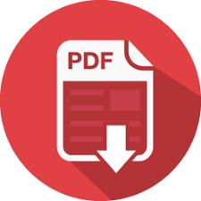

# Convertendo HTML em PDF
Esta aplicação converte um conteúdo HTML e PDF

## Features:
 A linguagem HTML foi utilizada para fazer a marcação da página e inserir o conteúdo que será convertido em PDF

 A linguagem PHP foi utilizada para fazer a conversão do conteúdo HTML para PDF, para isso ser possível, também utilizei a biblioteca DOMPDF

 Alinguagem CSS foi utilizada para criar o estilo do conteúdo HTML
